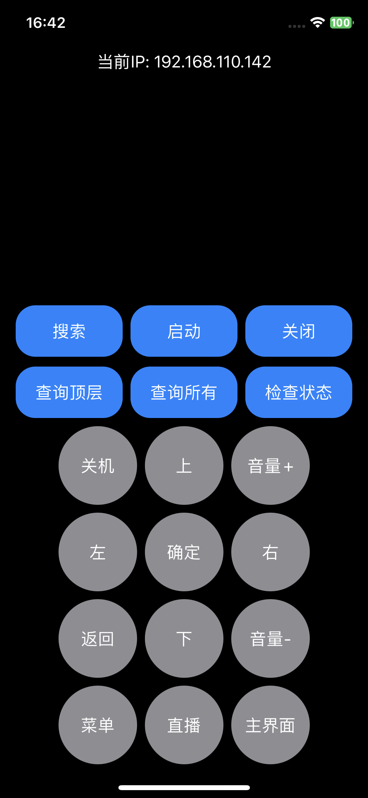
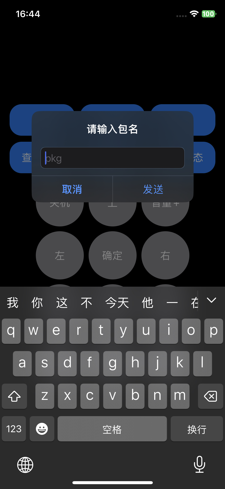

### 超级投屏-SDK-iOS集成文档
本sdk封装了发现扩展屏服务的相关接口。

#### 1、集成

- Swift Package Manager

```swift
dependencies: [
    .package(url: "https://github.com/hanliang-tech/es-cast-client-ios.git"),
],

```

- CocoaPods

  如果你更喜欢使用 CocoaPods，你可以在项目的 Podfile 中添加以下依赖项：

```ruby
target 'YourApp' do
  pod 'es-cast-client-ios'
end
```
然后在终端中运行 pod install 来安装依赖。   



#### 2、回调
``` swift
// 注册sdk代理回调
EsMessenger.shared.delegate = self
// 回调协议
public protocol MessengerCallback {
    func onFindDevice(_ device: EsDevice)
    func onReceiveEvent(_ event: EsEvent)
}

// 使用闭包回调
EsMessenger.shared.onFindDeviceCallback = {  device in
    print("onFindDeviceCallback: \(device)")
}
        
EsMessenger.shared.onReceiveEventCallback = {  event in
    print("onReceiveEventCallback: \(event)")
}

```

#### 3、基本使用

``` swift
// 调用搜索
EsMessenger.shared.startDeviceSearch()

// 本机ip
let ip = EsMessenger.shared.iPAddress

// 开启关闭调试日志
EsMessenger.shared.isDebugLogEnabled = true

// 在线状态检测
EsMessenger.shared.checkDeviceOnline(device: deive, timeout: 5) { online in
    print("\(deive.deviceName) status is: \(online)")
}

// 在线状态await检测
let online = await EsMessenger.shared.checkDeviceOnline(device: deive, timeout: 5)

// 添加参数
EsMessenger.shared
        .sendDeviceCommand(device: deive, action: .makeStartApp(apk: "xxx")
        .args("123")
        .splash(.display))
```

##### 3.1、常用操作指令
``` swift
/// 创建一个启动ES操作的EsAction
/// - Parameter pkg: 要启动的应用程序包的名称
/// - Returns: 返回包含启动ES操作数据的EsAction
static func makeStartEs(pkg: String) -> EsAction

/// 创建一个启动应用程序操作的EsAction
/// - Parameter pkg: 要启动的应用程序包的名称
/// - Returns: 返回包含启动应用程序操作数据的EsAction
static func makeStartApp(pkg: String) -> EsAction

/// 创建一个关闭应用程序操作的EsAction
/// - Parameters:
///   - pkgs: 要关闭的应用程序包的名称
/// - Returns: 返回包含关闭应用程序操作数据的EsAction
static func makeCloseApp(pkgs: String...) -> EsAction

/// 创建一个远程控制操作的EsAction
/// - Parameters:
///   - key: 远程控制键的枚举值
/// - Returns: 返回包含远程控制操作数据的EsAction
static func makeRemoteControl(key: ESRemoteControlKey) -> EsAction

/// 创建一个查询操作的EsAction
/// - Parameters:
///   - keyword: 查询关键字
/// - Returns: 返回包含查询操作数据的EsAction
static func makeQuery(keyword: String) -> EsAction

/// 创建一个查询应用程序列表操作的EsAction
/// - Returns: 返回包含查询应用程序列表操作数据的EsAction
static func makeQueryApps() -> EsAction

/// 创建一个查询顶部应用程序操作的EsAction
/// - Returns: 返回包含查询顶部应用程序操作数据的EsAction
static func makeQueryTopApp() -> EsAction

/// 创建一个自定义操作的EsAction
/// - Parameters:
///   - name: 自定义操作的名称
/// - Returns: 返回包含自定义操作数据的EsAction
static func makeCustom(name: String) -> EsAction
```

##### 3.2、EsDevice 属性
```swift
/// 发现设备的唯一标识。
public let id: String

/// 发现设备的名称。
public let deviceName: String

/// 发现设备的IP地址。
public let deviceIp: String

/// 发现设备的端口。
public let devicePort: Int

/// 发现起源的 APK 包名称。
public let from: String

/// 设备发现的时间戳。
public let findTime: TimeInterval

/// 设备支持的协议版本。
public let version: Int
```
##### 3.3、遥控器定义 ESRemoteControlKey
```swift
// 预定义的遥控器按键
case home // 主界面
case back // 返回
case up // 上
case down // 下
case left // 左
case right // 右
case ok // 确定
case volumeUp // 音量+
case volumeDown // 音量-
case menu // 菜单

// 自定义遥控器按键，包括名称和值
case custom(name: String, value: Int)
```